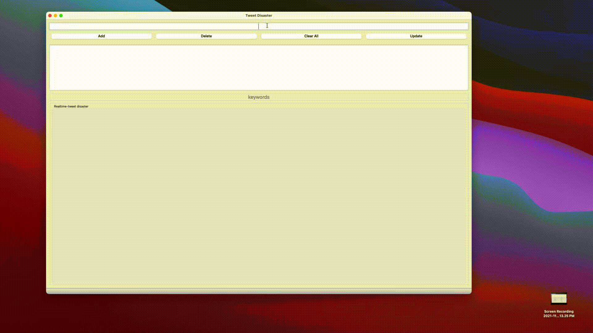
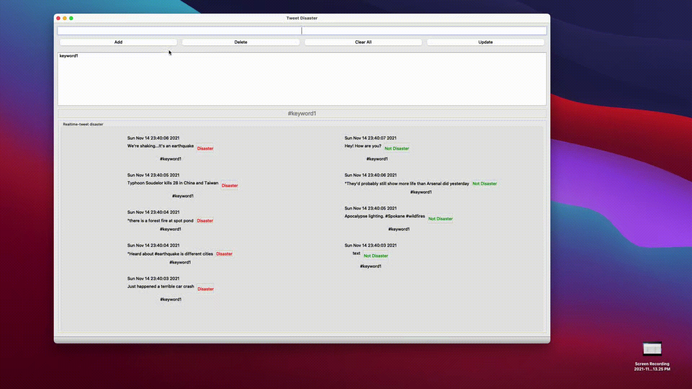
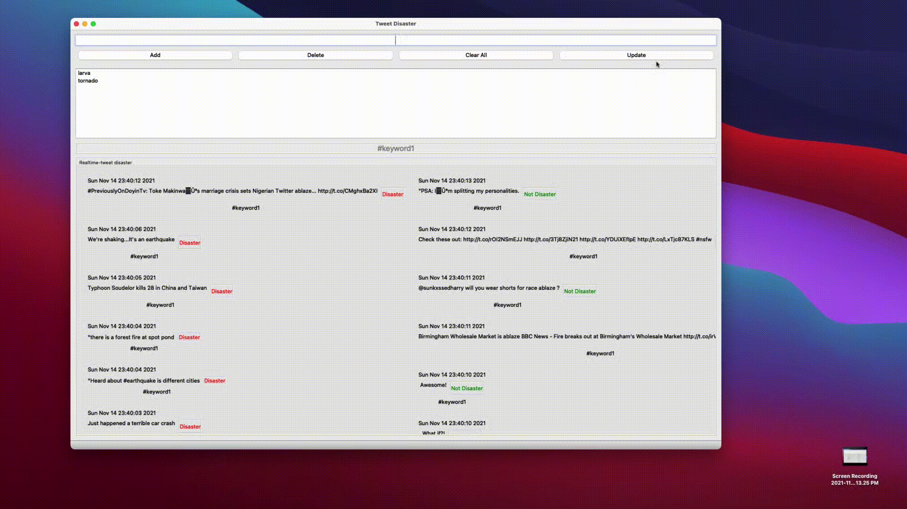
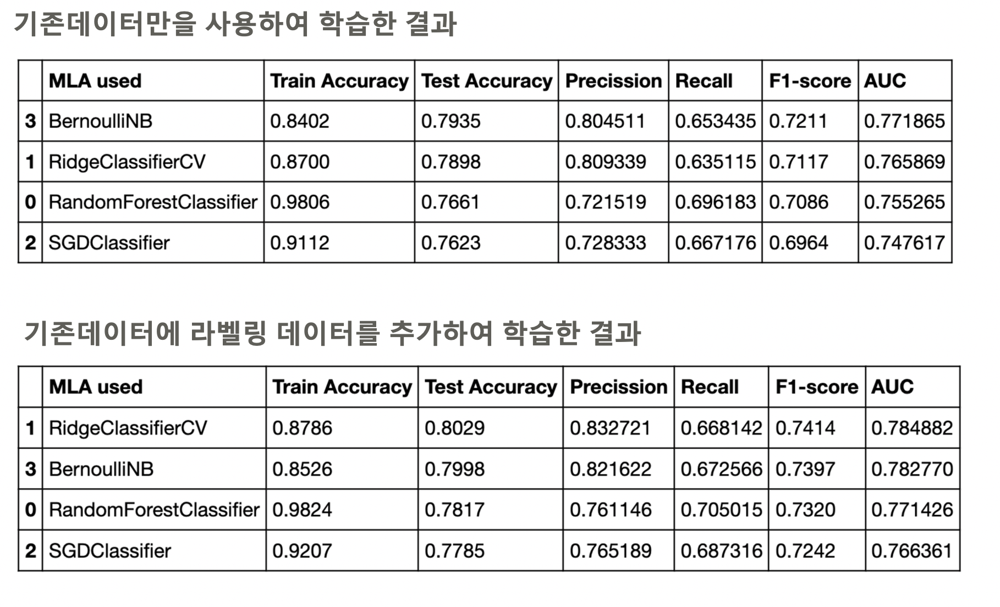
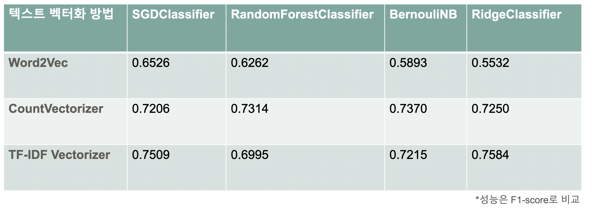
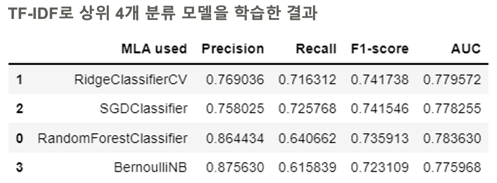

# Natural Language Processing with Disaster Tweets
### 2021-fall Machine Learning Project

# 주제 소개

------

- [Kaggle: Natural Language Processing with Disaster Tweets](https://www.kaggle.com/c/nlp-getting-started) 

- 트위터의 게시글 데이터로 재난/비재난 구분하기

- [기존데이터와 데이터 추가 학습 시 성능 분석 진행](#1-기존데이터와-데이터-추가-학습-시-성능-분석)

- [텍스트 벡터화 방법 별 성능 분석 진행](#2-텍스트-벡터화-방법-별-성능-분석)

  - Word2Vec, WordCount, TF-IDF

- [이진분류기 모델 별 성능 분석 진행](#3-이진분류기-모델-별-성능-분석)

  - RidgeClassifierCV, SGDClassifier, BernoulliNB, RandomForestClassifier

  
  

# 팀 소개

------

|     Member     |                       역할                       | 책임 |
| :---------: | :----------------------------------------------: | :---------------------------------: |
| [ElPlaguister(이승민)](https://github.com/ElPlaguister) | 팀장 | 크롤러, 데이터 라벨링 |
|  [jiminAn(안지민)](https://github.com/jiminAn)   |  | 데이터 라벨링, 텍스트 벡터화 테스트, 모델 학습 |
|    [wooseok(김우석)](https://github.com/woosook0127)   | | 데이터 라벨링, 모델 학습 및 튜닝 |
| [comeeasy(김준호)](https://github.com/comeeasy) |  | 데이터 전처리, GUI 제작 |

## GUI 기능 소개

------

### 기능1 UPDATE: 키워드 추가로 해시태그 별 (non-disaster/disaster) 게시글 보기 

- 키워드 입력 후. UPDATE 클릭시 해당 키워드로 좌측(non-disaster), 우측(disaster) 게시글 확인 가능

### 기능2 DELETE:  기존에 추가된 키워드 제거 후 새로운 키워드 추가 기능

- 키워드 추가 후 다시 UPDATE를 누르면 새로운 키워드로 게시글 확인 가능

 

 

# 핵심 폴더

------

**최종 버전 코드 저장된 핵심 폴더**

- `final_crawler` : 트위터 게시글 크롤러
- `final_data_preprocessing` : 데이터 전처리 
- `final_model`: 모델 학습 및 튜닝
- `final_gui`: gui 제작 

# 기타 폴더 

------------------------------
### 팀원들의 개인 코드 및 초안 버전 코드 저장 공간, 자세한 내용은 각 폴더의 README 파일을 참고
- [SMRee(이승민)](https://github.com/jiminAn/ML_Project/tree/main/SMRee)
  - `Cralwer`
  - `Random_Forest`
  - `catboost_info`
  - `kaggle`
- [jman(안지민)](https://github.com/jiminAn/ML_Project/tree/main/jman)
  - `catboost_info`
  - `code`
  - `practice_code`
  - `study`
- [joono(김준호)](https://github.com/jiminAn/ML_Project/tree/main/joono)
  - `data`
  - `docs`
  - `pyqt5`
- [wooseok(김우석)](https://github.com/jiminAn/ML_Project/tree/main/wooseok)
  - `TFIDF`
  - `data_processing`
  - `model`
  - `model_tuning`
  - `practice`

# 방법론 별 성능 분석

------

## 1. 기존데이터와 데이터 추가 학습 시 성능 분석 

  

## 2. 텍스트 벡터화 방법 별 성능 분석

- Word2Vec, WordCount, TF-IDF

  

## 3. 이진분류기 모델 별 성능 분석

- RidgeClassifierCV, SGDClassifier, BernoulliNB, RandomForestClassifier

  
